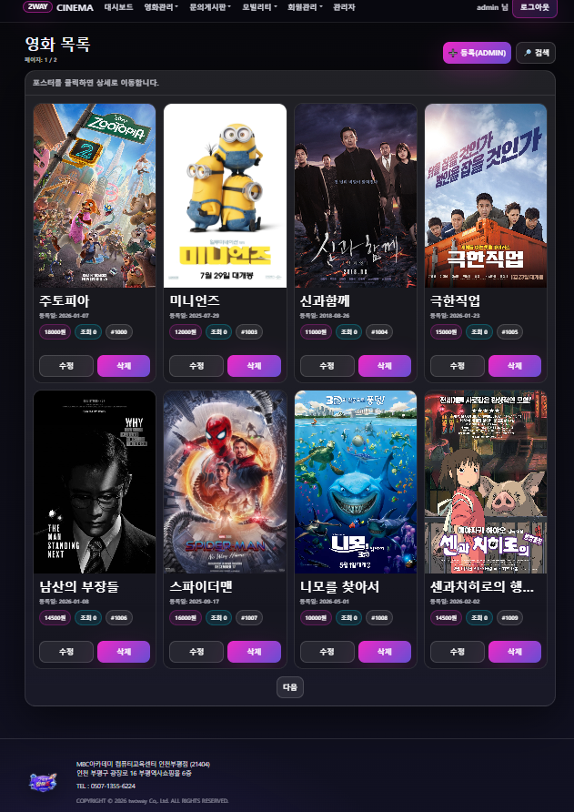
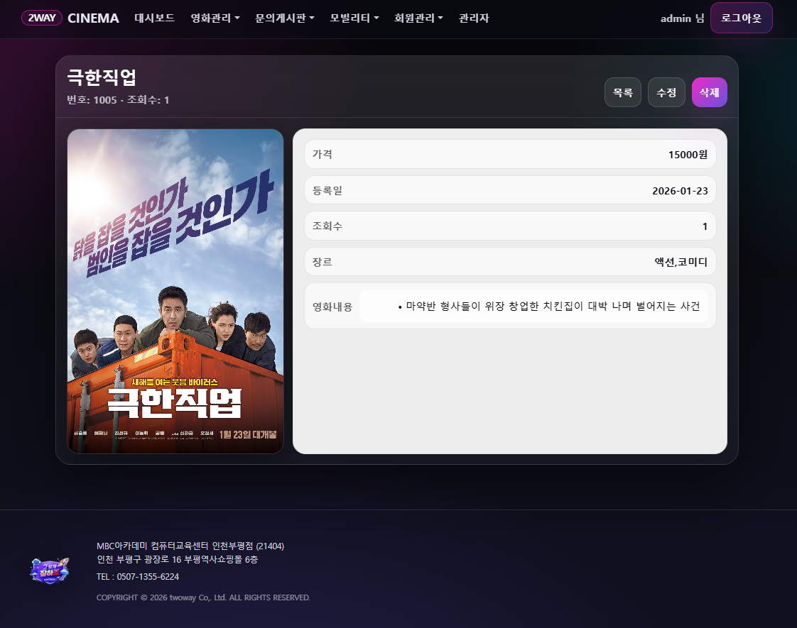

<div align="center">

# 🎬 TwoWay Movie
### 영화 관리 & 주차 서비스 통합 웹 애플리케이션


</div>

---

## 🎯 What & Why

| 항목 | 내용 |
|------|------|
| **무엇을** | 영화 예매 · 관리와 주차 서비스를 하나로 통합한 풀스택 웹 애플리케이션 |
| **왜** | CRUD 전 사이클 구현 + 사용자 게시판 + 서비스 통합 설계 경험 |
| **핵심 역량** | Spring Boot MVC 패턴, HTML/CSS 반응형 UI, REST API 설계 |

---

## 🖥 화면 구성

| 영화 정보 출력 | 상세보기 |
|---|---|
|  |  |

---

## 🏗 Architecture

```
twoway_movie_two/
├── src/
│   └── main/
│       ├── java/
│       │   └── com/twoway/
│       │       ├── controller/      # Spring MVC Controllers
│       │       ├── service/         # Business Logic Layer
│       │       ├── repository/      # JPA Repositories
│       │       └── entity/          # Domain Models
│       └── resources/
│           ├── templates/           # HTML Templates
│           │   ├── movie/
│           │   ├── parking/
│           │   └── board/
│           └── static/
│               ├── css/             # Custom Stylesheets
│               └── js/              # Vanilla JS Scripts
├── DB/                              # SQL Schema & Data
└── build.gradle
```

---

## 💡 Technical Highlights

### 1. 🎨 반응형 UI — Vanilla CSS Grid/Flex 레이아웃
- 프레임워크 없이 **순수 HTML/CSS** 로 구현한 반응형 레이아웃
- CSS Grid를 사용한 영화 카드 목록 + Flexbox 기반 상세 페이지 구조
- 미디어 쿼리를 통한 모바일/데스크탑 분기 처리

### 2. 🗄 Spring Boot MVC + 3-Layer Architecture
- Controller → Service → Repository 계층 분리 설계
- Spring Data JPA를 활용한 CRUD 자동화 (findAll, findById, save, delete)
- MySQL 연동 + Gradle 빌드 시스템

### 3. 📋 사용자 게시판 — 커뮤니티 기능
- 게시글 작성/수정/삭제 + 페이지네이션
- 세션 기반 사용자 인증 (로그인 / 로그아웃)
- 주차 정보 등록 및 조회 서비스 통합

---

## 🛠 Tech Stack

| Category | Skills |
|----------|--------|
| **Frontend** | HTML5, CSS3, JavaScript (Vanilla) |
| **Backend** | Java 17, Spring Boot 3.x, Spring MVC |
| **Database** | MySQL, Spring Data JPA |
| **Build** | Gradle |
| **Architecture** | MVC Pattern, 3-Layer (Controller/Service/Repository) |

---

## ⭐ Key Features

### 🎬 영화 관리 (완전한 CRUD)
- 영화 등록 (Create) — 제목, 감독, 장르, 개봉일, 포스터 이미지
- 영화 목록 조회 (Read) — 카드 형태 그리드 레이아웃
- 영화 정보 수정 (Update)
- 영화 삭제 (Delete) — 확인 모달 처리

### 🅿 주차 관리
- 주차 정보 등록 및 조회
- 실시간 주차 가능 여부 표시

### 💬 사용자 게시판
- 커뮤니티 게시글 CRUD
- 댓글 기능

---

## 📊 Lessons Learned

### 이슈 1: 이미지 업로드 & 파일 경로 문제
- **상황:** 영화 포스터 이미지가 서버 재시작 시 경로를 찾지 못하는 문제
- **원인:** Static 리소스 경로와 서버 파일 저장 경로 불일치
- **해결:** Spring Boot resources.static-locations 설정 + MultipartFile 처리로 절대 경로 저장

### 이슈 2: Spring MVC Form 데이터 바인딩
- **상황:** HTML Form POST 시 DTO 매핑 오류
- **원인:** @ModelAttribute 미적용 + 필드명 불일치
- **해결:** @ModelAttribute 어노테이션 + DTO 필드명 통일로 자동 바인딩 구현

---

## 🚀 Getting Started

```bash
# 프로젝트 클론
git clone https://github.com/youhanstat123-creator/twoway_movie_two.git
cd twoway_movie_two

# MySQL DB 설정 (application.properties)
spring.datasource.url=jdbc:mysql://localhost:3306/twoway_db
spring.datasource.username=root
spring.datasource.password=your_password

# DB 스키마 적용 후 빌드 & 실행
./gradlew bootRun

# 접속
# http://localhost:8080
```

---

## 👤 My Role

> 팀 프로젝트 참여 — **프론트엔드 UI 설계 & Spring MVC 백엔드 연동** 담당

- HTML/CSS 기반 반응형 UI 전체 설계 및 구현
- Controller ↔ View 데이터 바인딩 구현
- MySQL 스키마 설계 및 JPA Entity 매핑
- 영화 관리 + 주차 서비스 기능 통합 설계
